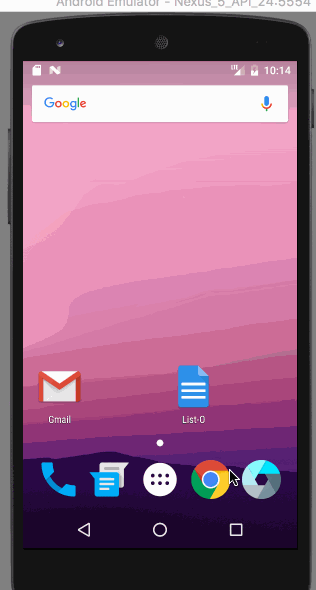

# List-O

A to-do list app for Android.

**Completed Features:**

 * [x] *Required*: Add a new task
 * [x] *Required*: Edit an existing task
 * [x] *Required*: Delete a task
 * [x] *Required*: Restore previously saved items on app restarts 
 * [x] *Extra*: Persist task items into SQLite instead of a text file 
 * [x] *Extra*: Styled UI (e.g. iconography, custom logo/branding, colors, typography), also added a splash screen.
 * [x] *Extra*: Set completion due dates for tasks 
 * [x] *Extra*: Set priority levels for tasks and display within ListView item
 * [x] *Extra*: Custom adapter for improved style of tasks within ListView
 * [x] *Extra*: Editable notes field for attaching longer descriptions/notes per task
 * [x] *Extra*: Adaptive to different screen orientations (landscape vs. portrait)
 * [x] *Extra*: Organized the app as per recommended way.

**GIF walkthrough of all required and optional stories:**

